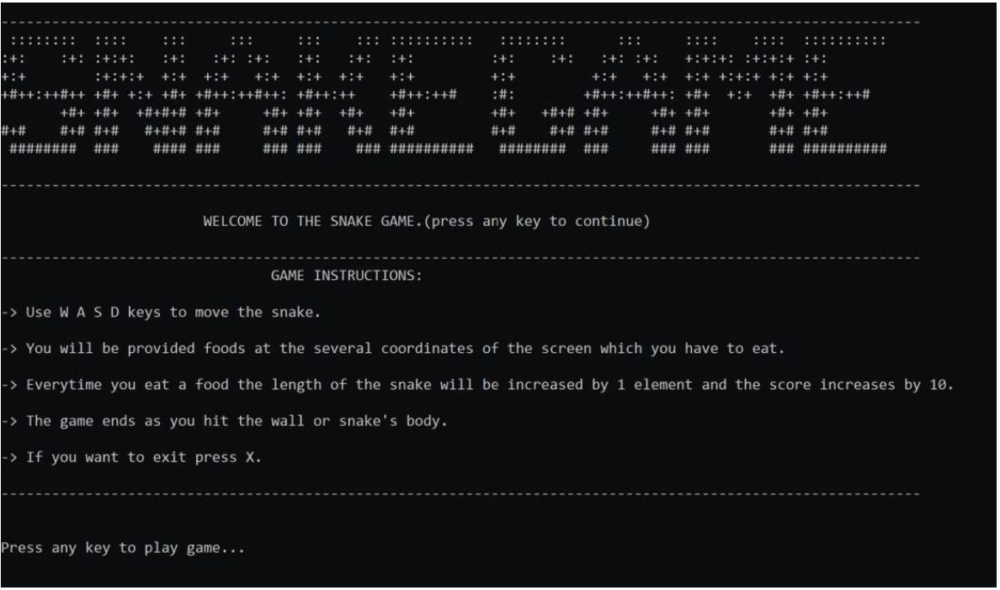
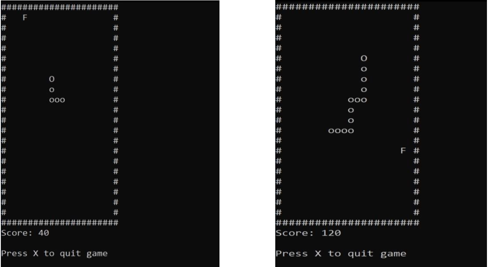
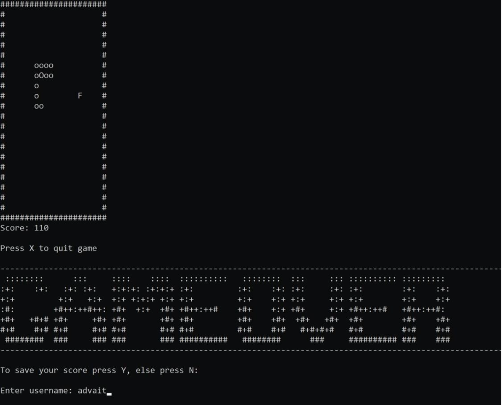
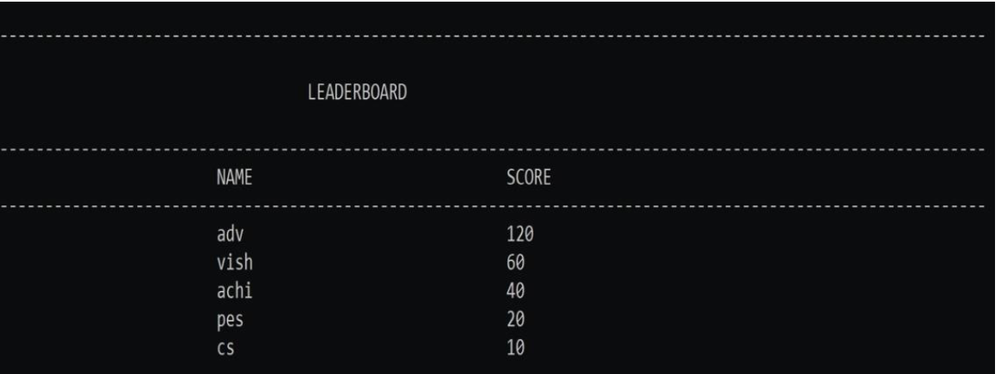

# Snake Game (implemented using C programming language)

This project is a simple text based console application, which is a recreation of the classic Snake game.

It has been implemented using C programming language

## Description

The Snake game has 3 main objects which are the snake itself, the food and the grid(20x20). The
snake’s length is initialised to 1 unit length. Its length increases as it goes on consuming more food
particles, denoted in the game by ‘F’. Each unit of food appears at random locations on the grid. It is
important to note that food cannot appear on any of the cells currently occupied by the snake.
The players goal is to move the snake to as many food blocks as possible. There is only one food
block at any given moment. When the food is eaten, the snake grows in length. If you hit the snake
itself, the game is over and the execution is terminated.
On execution of the code, an entry screen is displayed using simple print statements. The user now
has the option to click on any key to continue. Doing this will display game instructions to the user.
Once this is done, the grid is now displayed, which contains a particle of food ’F’ and the snake of
unit length. The game accepts keyboard input from the user(W,A,S,D) with the use of khbit() and
getch() functions. We use a multiway branching switch statement to actually move the snake based
on the user’s input. The function void Draw() draws the board and the snake at every instant. After
the snake has eaten a block of food, a new block appears at a randomised location. Simultaneously,
the score is also incremented by 10 points. The tail segment’s position is constantly updated based on
the previous segment’s position. If the headposition corresponds to one of the tailpositions, this
implies that the snake has bitten itself. Thus, the game ends and a gameover message is displayed.
The code corresponding to the gam’s logic is in the function Void Logic(). Once the game is over,
the function void End() accepts the player details and stores them in a binary file. A leaderboard with
all the scores of different users is then displayed which was created by writing and reading user data
onto binary files. An interesting component that we have also included is sound. The entire gameplay,
right from the entry page, the eating of food by the snake as well as the ending of the game is
accompanied by arcade like sounds which was done using PlaySound() function which is a part of
the Windows API.

## C-concepts used

Control Structures, Branching statements, enum, Functions, Arrays, Pointers, Structures, Reading and
writing onto Binary files and various other concepts

# Images

1. 
2. 
3. 
4. 
